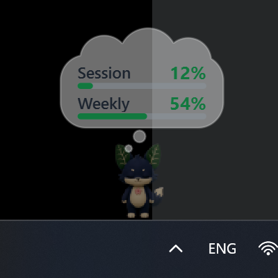

# Hachiko-Usage

A loyal little desktop pet that watches your Claude usage. He is a plant-fox
hatched by the Codex hatch pipeline (originally named Hojek), reborn as
**Hachiko-Usage**: he waits faithfully on top of your taskbar with a thought
cloud showing your Claude Code session and weekly usage limits.



## ⬇ Install in one press

**[Download Hachiko-Usage-Setup.exe](https://github.com/Freespirits/hachiko-usage/releases/latest)**

Launching it *is* the whole install — no wizard pages, no admin prompt. He
lands in `%localappdata%\Programs\Hachiko-Usage` and offers to come out
immediately. Windows 10/11.

> The exe is an unsigned hobby build, so SmartScreen may show
> "Windows protected your PC" — click **More info → Run anyway**.

## What he does

He starts in **ghost mode** — 50% transparent, click-through (your mouse goes
straight through him), and tiny — so he never gets in the way of real work.
His thought cloud shows live session/weekly usage percentages, and the text
stays fully readable even while he's ghosted.

## Controls

While click-through is on, the pet window ignores the mouse, so everything is
driven from his **system tray icon** (right-click it):

- states: wave, jump, fly, working, waiting, review, failed, idle
- `ghost 50%` — toggle the transparency
- `click-through` — toggle mouse pass-through (off = you can drag, click to
  wave, double-click to jump, right-click him directly)
- `size` — tiny (default), small, medium, large
- hide/show the usage cloud, quit

The tray tooltip also shows the current session/weekly percentages.

## Usage data

`desktop\hachiko_usage_desktop.pyw` polls
`https://api.anthropic.com/api/oauth/usage` with the local Claude Code OAuth
token from `~\.claude\.credentials.json`. Only the percentages are kept; the
token never leaves the request.

---

## For tinkerers

### Run from source

```
desktop\Start Hachiko-Usage.bat
```

(Uses the bundled venv: PySide6 + PyInstaller.)

### Build the installer yourself

```
cd desktop
venv\Scripts\pyinstaller.exe Hachiko-Usage.spec --noconfirm
ISCC.exe Hachiko-Usage.iss
```

This produces `desktop\installer\Hachiko-Usage-Setup.exe`.

### Also in this repo

- `index.html` / `hojek-atlas.png` / `hojek.json` — the original web sprite
  version and the hatch-pipeline atlas he is drawn from
- `hachiko-usage-post.png` — his announcement-post card
- `desktop3d.html`, `cute.glb`, `evil.glb`, `desktop/hojek3d_desktop.pyw` —
  the experimental 3D variant (still under the old name)
