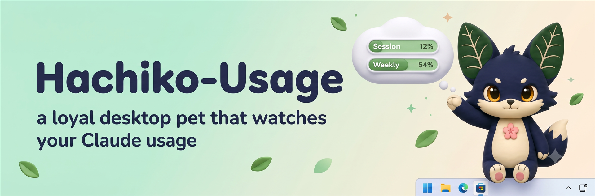
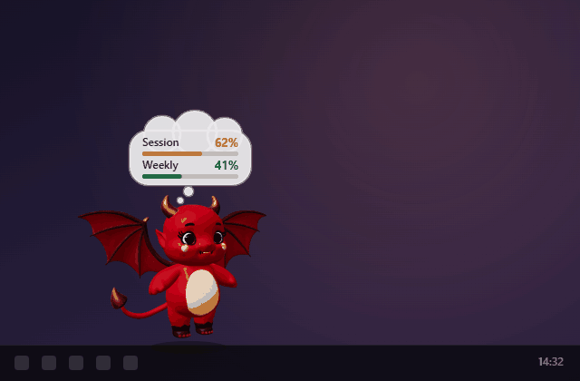

# Hachiko-Usage

<p align="center">
  <a href="https://github.com/Freespirits/hachiko-usage/stargazers"></a>
  
  
</p>

A loyal little desktop pet that watches your Claude usage. He is a plant-fox
hatched by the Codex hatch pipeline (originally named Hojek), reborn as
**Hachiko-Usage**: he waits faithfully on top of your taskbar with a thought
cloud showing your Claude Code session and weekly usage limits.

## ⬇ Install in one press

**[Download Hachiko-Usage-Setup.exe](https://github.com/Freespirits/hachiko-usage/releases/latest)**

Launching it *is* the whole install — no wizard pages, no admin prompt. He
lands in `%localappdata%\Programs\Hachiko-Usage` and offers to come out
immediately. Windows 10/11.

> The exe is an unsigned hobby build, so SmartScreen may show
> "Windows protected your PC" — click **More info → Run anyway**.

## What he does

He starts in **ghost mode** — 50% transparent, click-through (your mouse goes
straight through him), and tiny — so he never gets in the way of real work.
His thought cloud shows live session/weekly usage percentages, and the text
stays fully readable even while he's ghosted. Here he is on a real desktop:


## 😈 The 3D variant — Windows and macOS

There's a second pet in here: a real 3D character rendered with three.js inside
a transparent, frameless, always-on-top window, carrying the same usage
thought-cloud. He walks the taskbar, flies waypoints, flaps his wings (a vertex-
bend shader flexes the outer wing regions, so even an unrigged mesh comes
alive), waves, and occasionally gives up and naps.

<p align="center">
  
</p>

If he made you smile, **[give him a ⭐](https://github.com/Freespirits/hachiko-usage)** —
it's the only thing he eats.

**Run from source** (Python 3.11+, either platform):

```
pip install PySide6
pythonw desktop\hojek3d_desktop.pyw
```

```
python3 desktop/hojek3d_desktop.pyw
```

**Build a macOS `.app`**:

```
cd desktop && chmod +x build_app.sh && ./build_app.sh
```

That produces `desktop/dist/Devil-Usage.app` — a menu-bar-only accessory app
(`LSUIElement`, so no Dock icon; quit him from the menu-bar icon). It's
unsigned, so the first launch needs **right-click → Open**. Launch the `.app`
itself rather than the binary inside it: QtWebEngine needs the bundle layout to
find its helper process.

Two macOS-specific fixes live in the code, both no-ops on Windows —
`NoDropShadowWindowHint`, or a rectangular shadow frames the transparent window,
and `WA_MacAlwaysShowToolWindow`, because a `Qt::Tool` window is an NSPanel and
an NSPanel hides itself the moment another app takes focus, which for a desktop
pet is fatal.

His models are `cute-hd.glb` / `evil-hd.glb`. The lighter `cute.glb` /
`evil.glb` at the repo root belong to the **web** pet and are deliberately left
alone, so `index.html` stays mobile-friendly.

## Controls

While click-through is on, the pet window ignores the mouse, so everything is
driven from his **system tray icon** (right-click it):

- states: wave, jump, fly, working, waiting, review, failed, idle
- `pet` — switch between **Hojek** 🌱 the plant-fox and **Latch** 🛡 the
  pangolin-fox guardian (same app, same controls, different pet)
- `ghost 50%` — toggle the transparency
- `click-through` — toggle mouse pass-through (off = you can drag, click to
  wave, double-click to jump, right-click him directly)
- `size` — tiny (default), small, medium, large
- hide/show the usage cloud, quit

The tray tooltip also shows the current session/weekly percentages.

## Usage data

`desktop\hachiko_usage_desktop.pyw` polls
`https://api.anthropic.com/api/oauth/usage` with the local Claude Code OAuth
token from `~\.claude\.credentials.json`. Only the percentages are kept; the
token never leaves the request.

The 3D variant reads the same token, but the location is per-OS: the
`~/.claude/.credentials.json` file on Windows and Linux, and the login
**Keychain** (`Claude Code-credentials`, via `security find-generic-password`)
on macOS. The file is tried first either way. On macOS the first read shows a
one-time Keychain prompt, since the item was created by Claude Code and this is a
different binary asking — click **Always Allow**. Deny it and the cloud just
shows `…` while everything else keeps working.

---

## For tinkerers

### Run from source

```
desktop\Start Hachiko-Usage.bat
```

(Uses the bundled venv: PySide6 + PyInstaller.)

### Build the installer yourself

```
cd desktop
venv\Scripts\pyinstaller.exe Hachiko-Usage.spec --noconfirm
ISCC.exe Hachiko-Usage.iss
```

This produces `desktop\installer\Hachiko-Usage-Setup.exe`.

### Also in this repo

- `index.html` / `hojek-atlas.png` / `hojek.json` — the original web sprite
  version and the hatch-pipeline atlas he is drawn from
- `latch-atlas.png` / `latch.json` — Latch, the second pet: same 8×11 grid and
  frame counts as Hojek, plus generated 16-direction look rows (Hojek's were
  never generated). Known cosmetic nit: ~450 stray magenta pixels painted into
  a few frames by the generator; details in `latch.json` notes.
- `hachiko-usage-post.png` — his announcement-post card
- `desktop3d.html`, `cute-hd.glb`, `evil-hd.glb`, `desktop/hojek3d_desktop.pyw`,
  `desktop/DevilUsage-mac.spec`, `desktop/build_app.sh` — the 3D variant above.
  The script keeps its old filename so `desktop\Start Hojek 3D.bat` still works.
- `assets/icon.iconset/` — the PNG set `build_app.sh` feeds to `iconutil` to
  produce `hojek.icns` (Pillow can't write `.icns` anywhere but a Mac)
